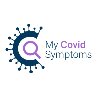

# MyCovidSymptoms

There is widespread distrust and confusion about the true number of COVID-19 patients out there. Most patients do not contact hospitals or clinics and never receive a diagnosis. Their number remains unknown to this day. It is important that these patients groups continue to leave health services alone so that they remain available for the patients that really need it. But this leaves us guessing the statistics, wondering at how many uncharted patients there really are.

MyCovidSymptoms is the answer to this need for clarity. An app that gathers anonymous data about its users’ fever and respiratory symptoms over the duration of their illness. The goal is to build a real-time map that displays the nations’ infection levels accurately and easily.

With MyCovidSymptoms’s data, authorities can create appropriate plans of action and make information-based decisions that keep us one step ahead of the problem. Users can feel safer knowing what areas to avoid and know to exercise heightened caution in risk areas.

## How to participate?

To participate, just sign up at https://MyCovidSymptoms.ie/ and use 1 minute once a day on the app.

## How to collaborate?

If you represent some other organization that could benefit of this, work on similar technology or for whatever reason want to collaborate, contact us by email on the address above. We are open to collaboration!

## How to contribute?

If you are an individual open source or open data minded person, we welcome you to contribute to this project!

Ways to contribute from the easiest to harder:

### 1. Help us gain more visibility

Following our social media accounts and share our announcements:

- Twitter: https://twitter.com/MyCovidSymptoms
- Facebook: https://www.facebook.com/MyCovidSymptoms/

### 2. Translate the app into your own language

Check out the source code folder https://gitlab.com/MyCovidSymptoms/MyCovidSymptoms/-/blob/master/app/src/assets/language/ to see if your language is already there. If your language is missing, copy the `en.json` and replace the English strings with your local language, and submit it to us by email or as a Gitlab merge request.

### 3. Get us in contact with your local national health authority

Please research some good contacts to your own national health authority and make an introduction by sending an email to both them and us (contact@MyCovidSymptoms.ie). From there we can easily pick up the discussion if they are interested.

### 4. Help us with design and research

Browse issues at https://gitlab.com/groups/MyCovidSymptoms/-/issues and chip in the discussion!

If you come across similar apps or initiatives, add them to the list in issue #1. If you want to help with the analysis and science, see issue #14. Discussion on what questions to ask is in #15, and UI design in #19 and marketing in #16.

### 5. Help us with coding and implementation

If you have HTML/CSS/JS skills, you can participate in front-end development. See `app/README.md` for details.

If you have Python/Flask skills, you can participate in back-end development. See `api/README.md` for details.

This is an open source project, so feel free to review the code, fix things you think are important and open a merge request for others to review.

## Video and sides

<!--- NOTE: iframe embeds don't work in Markdown (at least on on Gitlab), so use screenshots instead to mimick embeds and attract users to click on it -->
